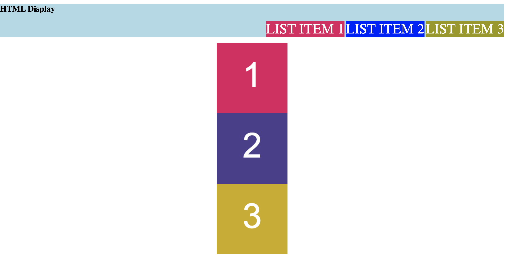

# Display

For this activity you will work with a partner to resolve issues within the given code:

## Instructions

* Fix the given code so that:
  * All three list items in the navigation bar should display inline.
  * All three boxes are visible.
  * Each box appeara centered and on its own line.

If successfule your code should look like the following:

## 💡 Hints

Which `display` value hides an element? 

---

## 🏆 Bonus

If you have completed this activity, work through the following challenge with your partner to further your knowledge:

* What is the CSS `visibility` property? How is it different from the `display` property?

The CSS `visibility` property controls the visibility of an element without removing it from the document's layout. Its primary purpose is to show or hide an element while maintaining the space that the element occupies in the layout.

Here are the key points about the `visibility` property:

1. **Values**:
   - `visible`: The default value. The element is visible.
   - `hidden`: The element is not visible, but it still takes up space in the layout.
   - `collapse`: Primarily used with table rows and columns. It removes the element as if it were `hidden`, but it's specifically meant for table elements to behave as if they are not part of the layout.

2. **Impact on Layout**:
   - Elements with `visibility: hidden` still affect layout. They occupy their defined space in the DOM but are invisible to the viewer.

In contrast, the `display` property affects both the visibility and the layout of an element. 

Here are the key points about the `display` property:

1. **Values**:
   - `none`: The element is not displayed at all. It is removed from the layout, and the space it occupied is collapsed.
   - Other values (`block`, `inline`, `inline-block`, `flex`, etc.) determine how an element is displayed and how it interacts with other elements in the layout.

2. **Impact on Layout**:
   - An element with `display: none` is both invisible and does not take up any space in the layout. It's as if the element does not exist in the document flow.

**Difference between `visibility` and `display`**:

- **Space Occupation**: An element with `visibility: hidden` still occupies space in the layout, while an element with `display: none` does not take up any space, as it's removed from the layout flow.
- **Reflow and Repaint**:
  - Changing `visibility` only triggers a repaint of the element (as its box is still in the layout).
  - Changing `display` causes a reflow of the page layout, which can be more computationally expensive, especially for complex layouts.

In summary, use `visibility` when you want to hide an element but maintain its space in the layout, and use `display` when you want to remove the element completely from the document flow, thus not occupying any space.

---
© 2023 edX Boot Camps LLC. Confidential and Proprietary. All Rights Reserved.
